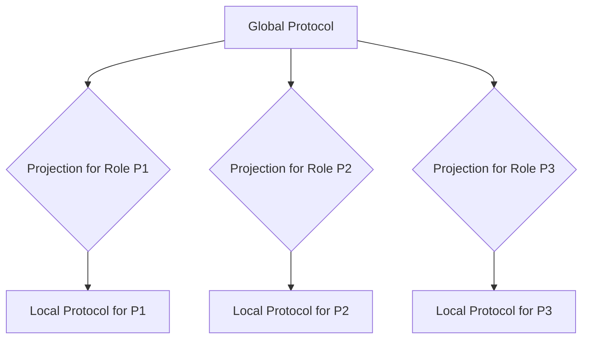

> **Note:** This document outlines design decisions and considerations for planned or experimental Multiparty Session Type (MPST) features. It may not accurately reflect the current implementation status in the library. Please refer to the main [Introduction](./introduction.md) for the current state.

---
# MPST Integration Design

## 1. Scope of MPST Support

The scope of MPST support in the `sessrums` library will focus on providing core abstractions for defining and working with Multiparty Session Types in Rust. This includes:

- **Global Protocol Definition**: A mechanism to define the overall interaction pattern involving multiple participants.
- **Protocol Projection**: Functionality to derive the local protocol for each participant from the global protocol.
- **Channel Management**: Support for establishing and managing communication channels between multiple participants according to the projected local protocols.
- **Basic MPST Constructs**: Initial support for fundamental MPST constructs like `Send`, `Receive`, `Choice` (Offer/Choose), and `Recursion`.

The initial integration will prioritize correctness and foundational support over performance optimizations or advanced features like delegation or dynamic participant sets.

## 2. Architecture for Integration

The integration architecture will extend the existing `sessrums` library structure, primarily within the `src/proto` and `src/chan` modules.

- **Global Protocol Representation**: A new data structure (e.g., `GlobalProtocol`) will be introduced to represent the global view of the interaction. This structure will likely mirror the existing local protocol representation but include information about all participants and their roles.
- **Projection Logic**: A function or method will be added to the `GlobalProtocol` structure to perform the projection. This will take a participant's role as input and return their corresponding local protocol (`LocalProtocol`).
- **Channel Adaptation**: The existing channel mechanisms will be adapted or extended to handle communication between multiple endpoints. This might involve a central coordinator or a peer-to-peer setup, depending on the chosen communication model. Initially, a simpler model (e.g., a central hub or pairwise channels managed by a coordinator) is preferred.
- **Role Management**: A clear way to define and manage participant roles within the global protocol will be necessary.

```rust
// Conceptual Global Protocol Definition (Rust-like pseudocode)
enum GlobalProtocol {
    Send { from: Role, to: Role, data_type: Type, next: Box<GlobalProtocol> },
    Receive { from: Role, to: Role, data_type: Type, next: Box<GlobalProtocol> },
    Choice { by: Role, branches: HashMap<Label, GlobalProtocol> },
    Offer { to: Role, branches: HashMap<Label, GlobalProtocol> }, // Offer from global perspective
    Choose { by: Role, branches: HashMap<Label, GlobalProtocol> }, // Choose from global perspective
    Recursion { label: RecLabel, protocol: Box<GlobalProtocol> },
    Variable { label: RecLabel },
    End,
}

// Conceptual Projection Function
impl GlobalProtocol {
    fn project(&self, role: Role) -> LocalProtocol {
        // Logic to derive the local protocol for the given role
        // ...
    }
}
```

## 3. Diagrams and Examples

### Diagram: Global Protocol and Projections



*Explanation*: A single global protocol defines the overall interaction. Each participant (P1, P2, P3) derives their specific local protocol by projecting the global protocol onto their role.

### Example: Simple Three-Party Protocol

Consider a simple protocol where Participant A sends a message to B, then B sends a message to C, and finally C sends a message back to A.

**Global Protocol:**

```text
A -> B: Data1
B -> C: Data2
C -> A: Data3
End
```

**Projection for Participant A (Local Protocol A):**

```text
Send<B, Data1>
Recv<C, Data3>
End
```

**Projection for Participant B (Local Protocol B):**

```text
Recv<A, Data1>
Send<C, Data2>
End
```

**Projection for Participant C (Local Protocol C):**

```text
Recv<B, Data2>
Send<A, Data3>
End
```

This example illustrates how a single global definition translates into distinct local behaviors for each participant. The `sessrums` library will provide the tools to define the global protocol and automatically derive these local projections.